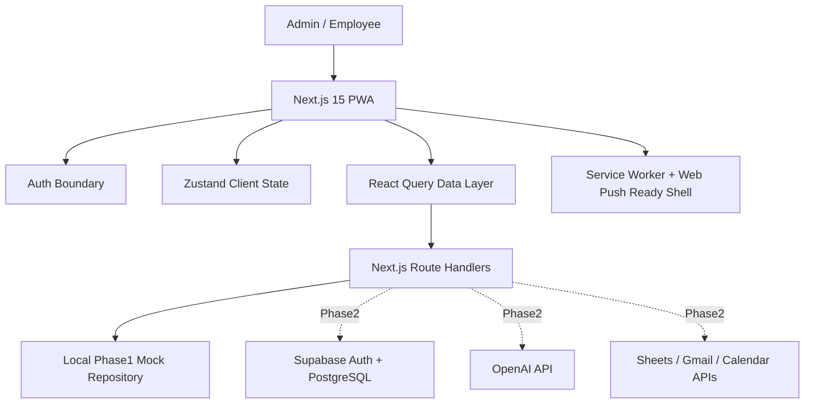

# Nos OS Phase1 Architecture

## Product Goal

Nos OS is an internal business OS for NosTechnology teams running web production,
system development, and AI process improvement work. Phase1 focuses on a local,
mobile-first operational prototype that can later be connected to Supabase,
Google OAuth, Google Sheets, Gmail, Calendar, and OpenAI.

## Architecture Overview

## Phase1 Implementation Strategy

- Use Next.js App Router with TypeScript and TailwindCSS.
- Provide local demo auth for Admin and Employee roles while keeping the auth
  adapter shape compatible with Supabase Auth.
- Keep data access behind repository-style route handlers so mock data can be
  replaced with Supabase queries without rewriting screens.
- Implement dashboards, employees, projects, tasks, attendance, notifications,
  AI assistant, and settings as real interactive screens.
- Store local user/session choices in browser storage for testability.
- Ship a PWA manifest and service worker for installability and offline shell
  caching.

## Runtime Layers

| Layer | Phase1 | Phase2+ |
| --- | --- | --- |
| UI | Next.js, TypeScript, TailwindCSS, lucide-react | shadcn/ui hardening |
| State | Zustand for session/navigation preferences | same |
| Server state | TanStack React Query | same |
| API | Next route handlers returning typed mock data | Supabase + Google + OpenAI |
| Auth | local role-select login | Google OAuth and email login |
| DB | SQL schema and seed-like TS data | Supabase PostgreSQL |
| Notifications | in-app + PWA permission flow | Push subscriptions |
| AI | OpenAI-ready secretary with local fallback | OpenAI-powered analysis and voice workflows |

## Role Model

- `admin`: can view company-wide dashboards, employee status, project finance,
  all tasks, all attendance, and admin notifications.
- `employee`: sees own tasks, own attendance, assigned projects, leave balance,
  notifications, and AI suggestions.

## Extension Points

- `src/lib/data/*`: typed domain data and repository functions.
- `src/app/api/*`: future backend adapter boundary.
- `src/lib/auth/*`: Supabase Auth can replace local session implementation.
- `src/lib/integrations/*`: OpenAI, Claude fallback, Google Sheets, Gmail, and
  Calendar adapters live here.
- `supabase/schema.sql`: canonical database definition for Phase1 tables.

## Non-Goals For Phase1

- Real Google OAuth callback handling without project credentials.
- Real Supabase connection without URL/key.
- Real push delivery without VAPID keys and push subscription storage.
- Real Gmail/Calendar API calls.
