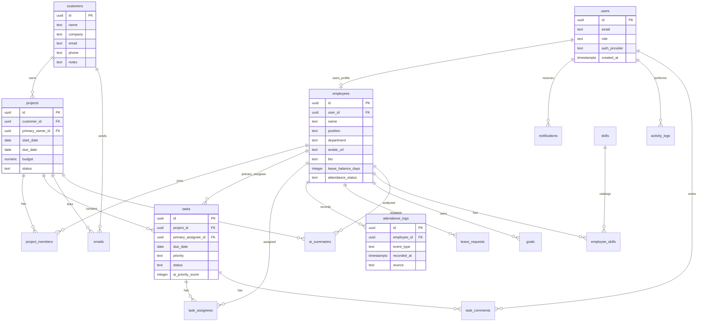

# Nos OS ER Diagram

```mermaid
erDiagram
  users ||--o| employees : owns_profile
  users ||--o{ notifications : receives
  users ||--o{ activity_logs : performs
  employees ||--o{ project_members : joins
  projects ||--o{ project_members : has
  customers ||--o{ projects : owns
  projects ||--o{ tasks : contains
  employees ||--o{ tasks : primary_assignee
  employees ||--o{ task_assignees : assigned
  tasks ||--o{ task_assignees : has
  tasks ||--o{ task_comments : has
  users ||--o{ task_comments : writes
  projects ||--o{ emails : links
  customers ||--o{ emails : sends
  employees ||--o{ attendance_logs : records
  employees ||--o{ leave_requests : requests
  employees ||--o{ goals : owns
  skills ||--o{ employee_skills : catalogs
  employees ||--o{ employee_skills : has
  employees ||--o{ ai_summaries : analyzed
  projects ||--o{ ai_summaries : summarized

  users {
    uuid id PK
    text email
    text role
    text auth_provider
    timestamptz created_at
  }

  employees {
    uuid id PK
    uuid user_id FK
    text name
    text position
    text department
    text avatar_url
    text bio
    integer leave_balance_days
    text attendance_status
  }

  customers {
    uuid id PK
    text name
    text company
    text email
    text phone
    text notes
  }

  projects {
    uuid id PK
    uuid customer_id FK
    uuid primary_owner_id FK
    date start_date
    date due_date
    numeric budget
    text status
  }

  tasks {
    uuid id PK
    uuid project_id FK
    uuid primary_assignee_id FK
    date due_date
    text priority
    text status
    integer ai_priority_score
  }

  attendance_logs {
    uuid id PK
    uuid employee_id FK
    text event_type
    timestamptz recorded_at
    text source
  }
```

