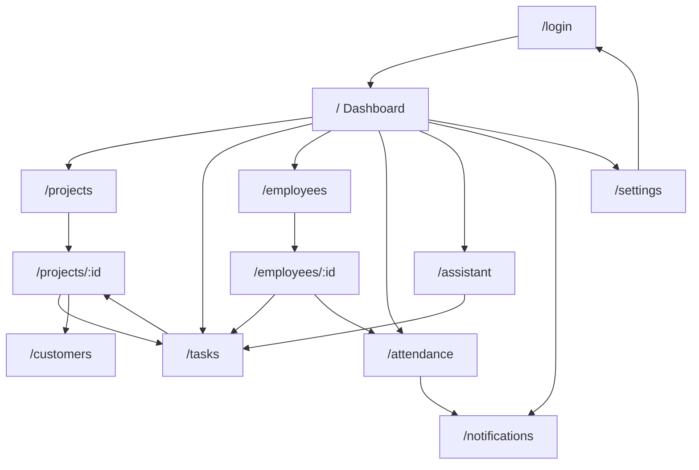

# Nos OS Screen Transition Diagram

## Navigation Principles

- Every primary workflow is reachable within two taps from the mobile bottom nav.
- Detail pages always keep a clear return path to the related list.
- Admin-only sections appear disabled or summarized for general employees.
- AI recommendations deep-link into tasks or project detail pages when backed
  by a target record.

